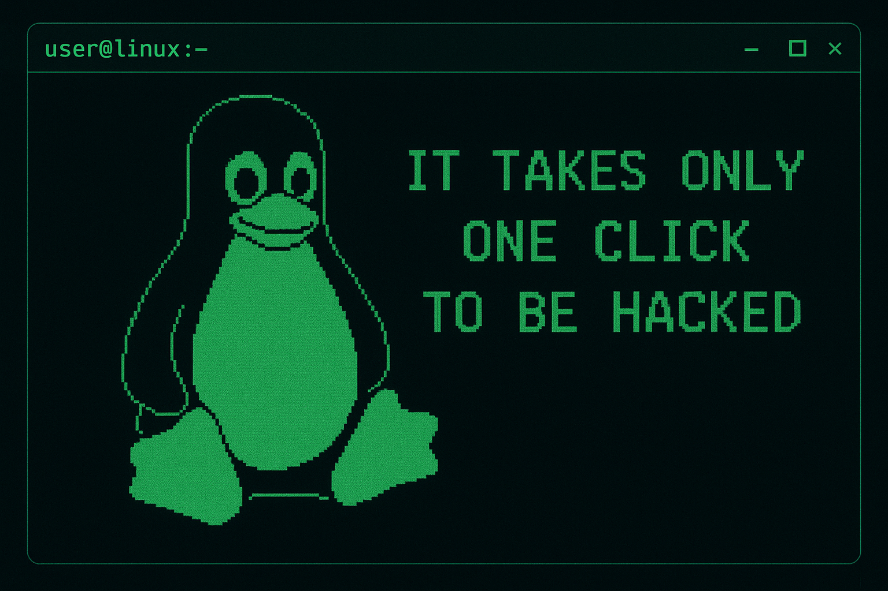

<!-- HEADER -->

<h1 align="center"> Wanna be SOC Analyst</h1>
<h3 align="center">Let the suffering begin... but for adversaries 🕵️‍♂️🔍</h3>

  

### 🧩 About Me  
  
- 🛡️ Blue Team focus: **SOC operations, detections, threat hunting**  
- 🔭 Currently working on: **[CTFs](https://w3nch.github.io/)** & detection playbooks  
- 🌱 Learning: **Networking, Splunk, Zeek, DFIR, Threat Intel**  
- 👯 Looking to work on: **SOC automation & detection engineering**  
- 📝 Writing on: [Medium](https://medium.com/@wr7nch)  
- 💬 Ask me about: **Packet analysis, Wireshark, Nmap, Zeek scripting**  
- 📫 Contact: **wrench999@proton.me**  

### 📡 Connect With Me  

  
  

  

### 🛡️ My Security Platforms

  &nbsp;&nbsp;&nbsp;
  &nbsp;&nbsp;&nbsp;
  

### 🖥️ Coding / Dev  

  

  

### 🛡️ Blue Team / SOC  

  
  
  
  
  
  
  
  
  

  

### 🏴 Red Team / Adversary Simulation  

  
  
  
  
  
  
  

  
 
 

### 📊 GitHub Stats  

  
  
  

  
 
 

### 📚 Blog Posts  

- [Medium Articles](https://medium.com/@wr7nch)  
- [My Blog on GitHub](https://w3nch.github.io/)  

  

  

